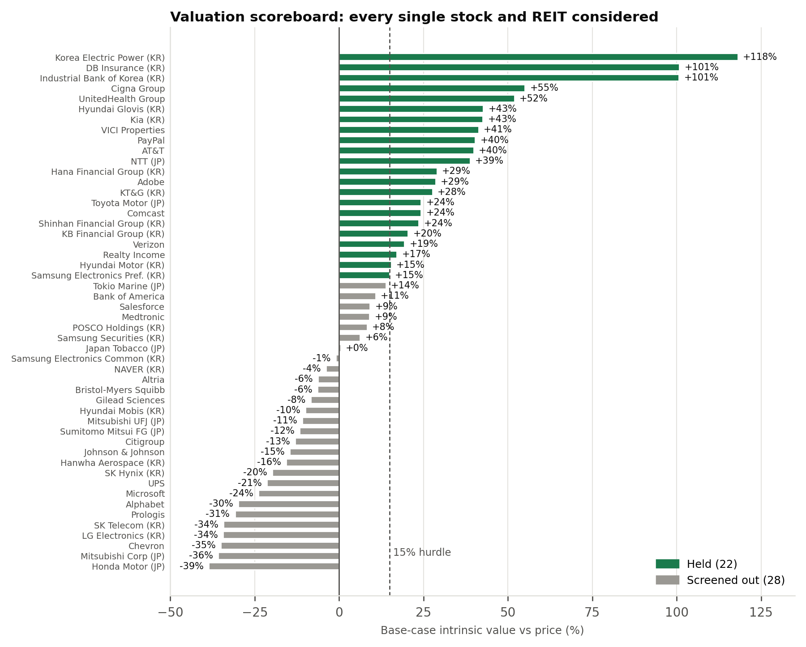
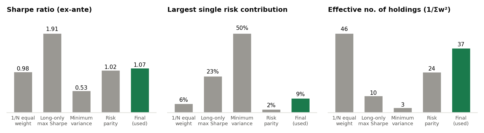
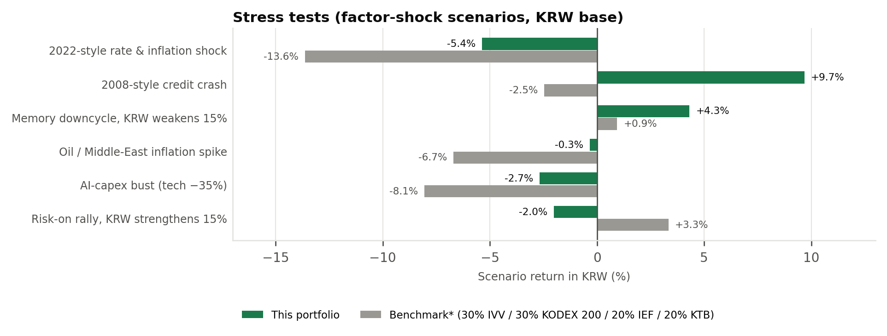

# Jung Ryul Lee Portfolio

A portfolio construction memo built from the bottom up: each single stock is valued with a cash-flow model and held only if it shows at least 15% upside; weights come from a constrained optimiser; risk is checked with a factor model and stress tests. Measured in KRW for a Korean investor.

**Author:** Jung Ryul · FMBA (Finance & Business Analytics), SKK Graduate School of Business
**Data as of:** 22–26 September 2026 · **Holdings:** 22 US + 19 Korea + 5 Japan

📄 **[Read the memo (PDF)](report/Portfolio_46_Assets.pdf)** · 📓 **[Notebook](notebook/Portfolio_Optimization_46.ipynb)** · 📊 **[Final weights (CSV)](data/final_weights.csv)**

## Summary (ex-ante, KRW)

| | Portfolio | Benchmark* |
|---|---|---|
| Expected return | 9.4% | 6.3% |
| Volatility | 6.1% | 8.7% |
| Sharpe (vs 2.8% KRW cash) | 1.07 | 0.41 |
| Beta to S&P 500 / KOSPI 200 | 0.28 / 0.11 | – |

*30% IVV / 30% KODEX 200 / 20% IEF / 20% KODEX 10Y KTB.

## Method

1. **Valuation screen.** 50 stocks and REITs valued with the model that fits each business: FCFF/FCFE DCF, normalised-cycle DCF (memory makers), justified P/B (banks, insurers, autos), justified P/E (Japan), two-stage AFFO (REITs). CAPM cost of equity per market. Held only if base-case upside ≥ 15%; 22 pass.
2. **Expected returns.** Cost of equity plus only half the valuation gap closing over three years, to limit error-maximisation.
3. **Risk model.** 10-factor covariance Σ = B·F·Bᵀ + D, including USD/KRW and JPY/KRW factors (both currencies have tended to rise when Korean assets fall).
4. **Optimisation.** Max Sharpe with a risk-parity penalty, subject to mandate limits (single stocks ≤ 3%, hedges ≥ 38%, Korea 25–36%, Japan 6–12%).
5. **Checks.** Stress tests, comparison with 1/N, long-only max-Sharpe, minimum variance and risk parity, and re-optimisation under noisy expected returns.



## Key finding

Equal-weighting the same 46 assets gives almost the same Sharpe, and risk parity does too without using any valuations. Most of the value comes from **selecting the assets**; the optimiser mainly enforces the mandate (lower volatility, hedge floor, position caps). Consistent with DeMiguel, Garlappi & Uppal (2009).




## Largest positions

| Ticker | Name | Market | Sleeve | Weight |
|---|---|---|---|---|
| IVV | iShares Core S&P 500 ETF | US | Growth | 5.00% |
| TAIL | Cambria Tail Risk ETF | US | Hedge | 4.50% |
| BTAL | AGF US Market Neutral Anti-Beta ETF | US | Hedge | 4.50% |
| DBMF | iMGP DBi Managed Futures ETF | US | Hedge | 4.00% |
| SGOV | iShares 0-3M T-Bill ETF | US | Hedge | 3.75% |
| KMLM | KFA Mount Lucas Managed Futures ETF | US | Hedge | 3.50% |
| VTIP | Vanguard Short-Term TIPS ETF | US | Hedge | 3.25% |
| 2561 | iShares Core Japan Govt Bond ETF | JP | Hedge | 3.25% |
| 033780 | KT&G | KR | Growth | 3.00% |
| 015760 | Korea Electric Power | KR | Growth | 3.00% |
| 024110 | Industrial Bank of Korea | KR | Growth | 3.00% |
| 005830 | DB Insurance | KR | Growth | 3.00% |

Full list: [data/final_weights.csv](data/final_weights.csv).

## Repository

```
report/     PDF and Word memo
notebook/   Portfolio_Optimization_46.ipynb (runs offline, reproduces every number)
src/        model.py (valuations, risk model, optimiser, stress tests)
            optimizer_comparison.py (five weighting methods, robustness)
            charts.py (all figures)
data/       results.json, results_opt.json, final_weights.csv
```

Reproduce: `pip install -r requirements.txt`, then `cd src && python model.py && python optimizer_comparison.py && python charts.py`.

## Limitations

- Factor volatilities, correlations, loadings and stress shocks are the author's assumptions anchored to history, not estimated from a price download. The notebook shows how to replace them with a Ledoit–Wolf estimate from real returns.
- Normal VaR understates fat tails; TAIL's option payoff is non-linear.
- Some inputs are estimates (Samsung and SK Hynix net cash, KRW CD yield, J-REIT yield, several normalised ROEs); every valuation shows a sensitivity grid.
- Toyota is held through its NYSE ADR (TM) because Tokyo trades in 100-share lots.

**For discussion and educational purposes only. Not investment advice.**
